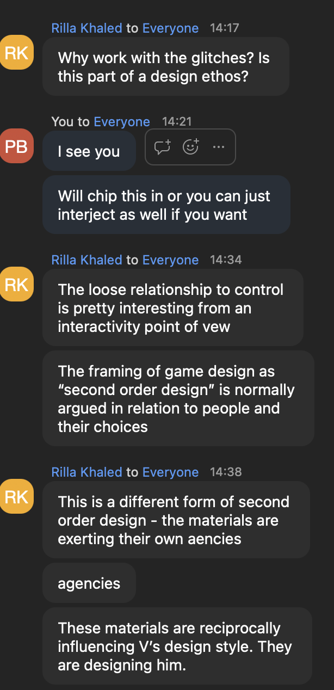

# Thursday, 5 February 2026, Pippin's Notes

- Pippin asks about the technical process +/versus/with the design process
- Making the technical infrastructure *visible* - the special vision thing where you use the raw output of the normals view as a "view" onto the world (what does this mean do we think?)
- Textures representing the data being calculated as another kind of view
- "I want to use what I have as much as I can" -- if I calculate a bunch of data that's in the backend, how can I use that in the game itself and part of the player experience
- Austin asked a question I did not quite hear and it triggers Vadim to talk about a specific reflection, is able to show a screenshot of some kind of crazy data.... a kind of display of the vram, some of the things from the scene... a situation where he did "the wrong thing", writing into the wrong place (which compute shader allows to happen, more responsibility)... the result is really amazing looking
- "I've always tried to work with the glitches the engine produces" - shadow bias, striated shadow stuff, shadow acne, -- wanted to make that *part of the world*
- Austin: player is extracting resources, the evidence of that is in the fog, -- autographic visualization: the more you extract resources in the world you extract resources from the game... "tree rings" as data, ice core - Cam: "It tells you what it is through how it looks" ... (which is more interesting ecosystem talk that feels related)
- Ecosystem: Compute Shaders as a "way to do" the ecosystem, that they give the power to deal with the kind of scale required (e.g. thje bamboo)...
    - In games the idea that scale tends to mean you end up with something static; and if you want high levels of dynamics then scale has to be small
- Compute Shaders as unlocking a different way of thinking - thinking about translating data from one shape into another; everything you do is a "float" in some basic sense - so a 3D vector become three floats, because that's what the GPU can manage
- Compute Shader forces you to break things down into simpler steps because there's a limited set of what you can do in there (e.g. you have to define Pi if you need it)
- Texture resolution sets the resolution that the bamboo can actually be grown at (more ecosystem stuff here...?)
- Fluid dynamics formulas from online to apply to the haze...
- Rilla: Vadim wanting to "reuse everything"; is this part of a "unified strategy"? Always thinking about efficiencies, use what I have as much as I can - feels computer science-y? (Pippin: but also quite eco, sustainability, ... upcycling? Using the whole animal?)
- Vadim: I like the idea of limitations, that it opens things up, serves as a guide - can be overwhelming if you don't have boundaries (Yay for my book! Makes me think of Lyne's voice note about the experience of designing pre- and post-Bitsy encounter)
- The idea that a glitch/view "makes sense" in the world... it's a "free thing that you get"
- Austin: getting us back to that core surprise of the game, which is about overextraction - could this be literally reflected in terms of the computational resources of the game (dropped frames, what if the game's actual computational ecosystem began to fail?)
- Vadim: like to think that's kind of what's going on now - when the haze goes up, the visuals (literally) make it more difficult to see
- Might be hard to map/really make the computational material reflect the ecosystem but tricky to control for that (hard to control the messaging)...
- Conversation about the game's resolution, evoking the older games that used to have a frame and a much smaller/low res version of the world
- The beam of light coming out of the collector flickers because it's about the time it takes to perform an underlying computation
- Who is this for: people who like weird games
- Rilla: design in HCI: about controlling the experience; is this more of a "relational" approach? More about getting a sense of the material, work with it, reframe "flaws" as characteristics of the material that become part of the game... 
- A big question of incorporating the computational substrate versus having total control over the player's experience - is this a major tension?
    - "It's fine" - you don't see it that often because people don't want to have it in their game. Gives the example of low resolution as a thing people often avoid, the idea of new technologies being about eliding/concealing the nature of the underlying machine nature of it... make things look better and better, photorealism...
- "I don't to want make an arty game, I want it to be fun too" -- the idea that there are games out there that use or foreground glitchy/wrong parts of game engines, but not necessarily toward a "fun" player experience...
- Rilla: Vadim is "second order designing" in the sense of these computational materials, design is passing through those materials to the world he's making // and then again there's the second order design of vadim to game to player
- Pippin: how does this conversation function relative to the overall project?
- Vadim: helpful; had a convo with Stephen about pacing as a specific element of this whole thing
- Austin: where does this go? Gallery setting? Steam? (Vadim mentioned steam earlier)
- Vadim: still want to make an autoplaying version of this, with a camera in motion, or an AI player, or a simple slider-based physical thing where you just mess with the ecology "directly" - "the game path does not work in an exhibition setting"
- Austin: have you tried it on CRT/other screens?
- Vadim: yep! Tried it out a while back, would be nice to see it again
- Cam: where are you on instructing/helping the player know what to do?
- Vadim: have a rough concept around this - teach the player the mechanics ideally without any text. Start in space about to land, can only scan for stuff; player base starting out closed and requiring that you do stuff in order to open it up; gradual introduction of mechanics...
- Started with feel: music, floating cube, tone mapping, colours... "maybe establish a mood to guide me in my decisions"
- "I guess I refer make to what I remember in the [original] game"
- "Everything is a deeper implementation"  (relative to the original)
- Lens flare in Unreal - "I'm trying to work with it", lens flare as a kind of inevitability, leaning into it...
- The question of an end game, could the meta view of the computational substrate is a way for there to be an ending
- Austin: back to who is the player - in terms of the surprise of extraction and ecology some people *are* winning at the extractive end...

## Zoom chat screenshot
